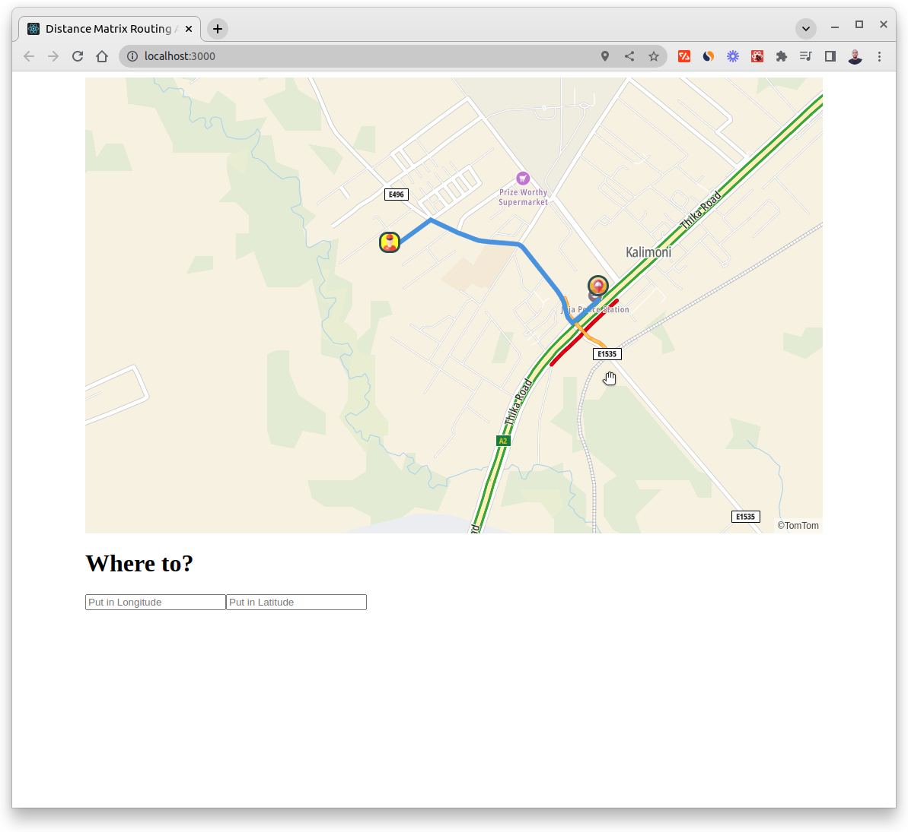
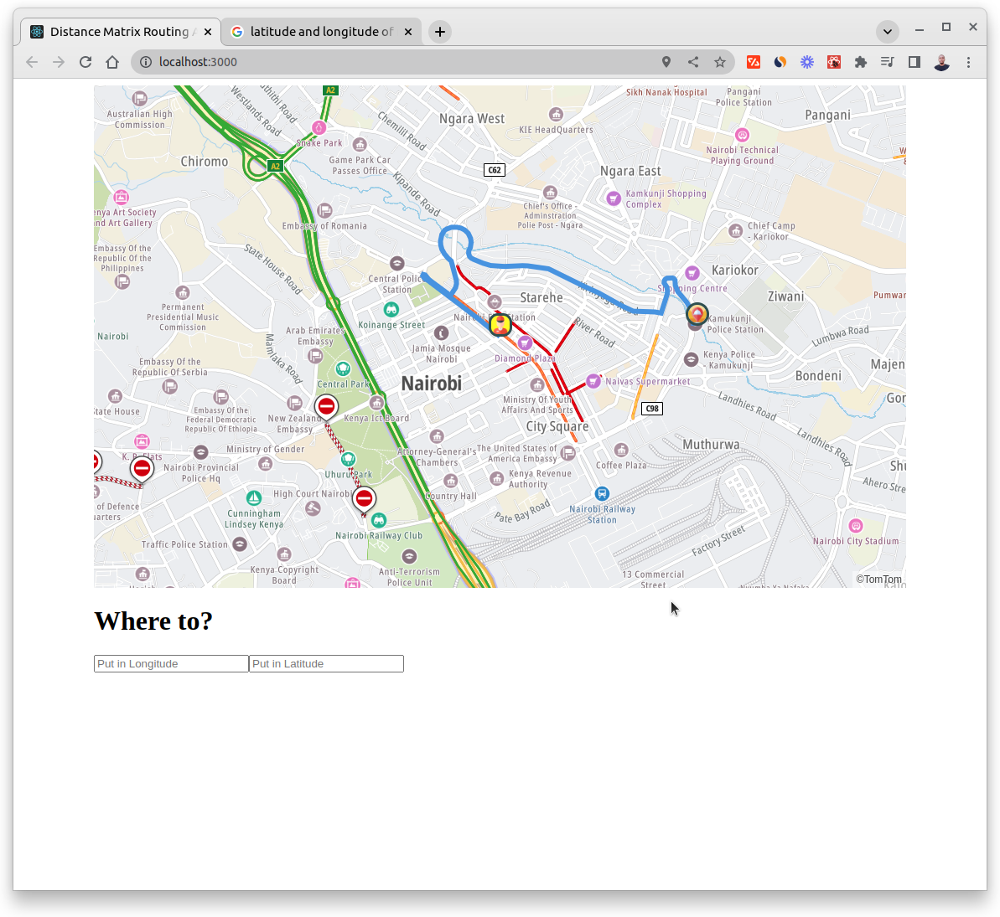

# Distance Matrix Routing





Have you ever wanted to build a delivery app that will calculate the shortest distance from each drop off spot?

We are going to be using TomTom Map SDK for Web, to show us the best route for us as the delivery driver, to drop off all three deliveries based on time, taking:

1. The route into account
2. The traffic on the roads into account.
3. The traffic incidents on the roads into account

The final route is calculated using the “Routing API” which by default will do a “car”  route. But it can do way more than that. It can calculate the routes for motorcycles, vans, trucks or pedestrians! As you can image, the results will vary.

## Setup

```code
# Clone this repo
git clone https://github.com/hesbon-osoro/distance-matrix-routing.git

# Navigate to directory and install packages
cd distance-matrix-routing && yarn

# Start the App
yarn start
```

Open [http://localhost:3000](http://localhost:3000) to view it in the browser.

[](https://www.buymeacoffee.com/wazimu)
